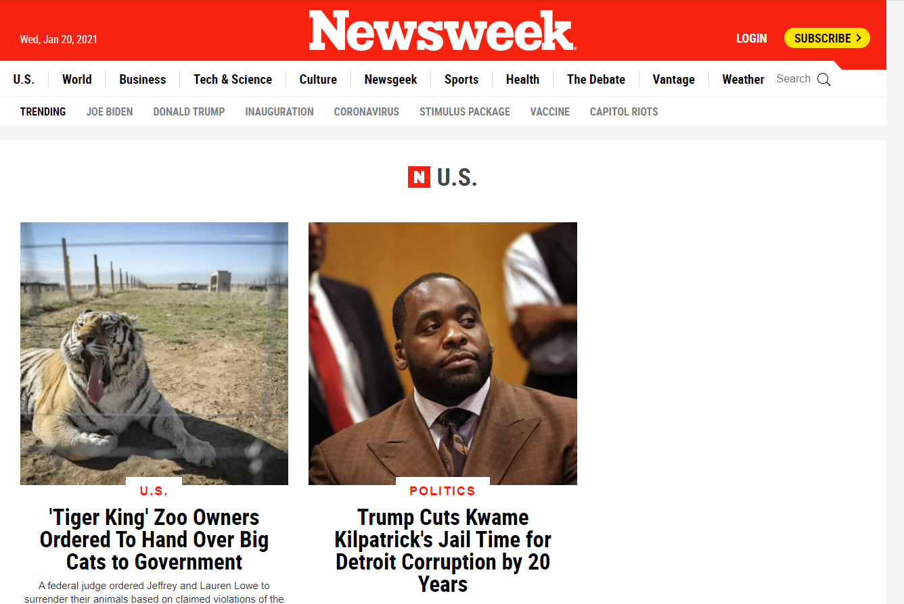

# Newsweek

> This is a clone of newsweek webpage using HTML CSS, and bootstrap.  

> The goal here is to make a responsive website using bootstrap fundamentals.

## Built With

- HTML5, CSS3
- Bootstrap
- Windows/Linux

## Live Demo

[Live Demo Link](https://mrigorir.github.io/newsweek/)

### Deployment

-You can deploy this project cloning it on GitHub and then going to:
->Repository
->Settings
->GitHub Pages
(Select source)
->Save

## Authors

👤 **Marco Parra**

- GitHub: [@mrigorir](https://github.com/mrigorir)
- Twitter: [@marcoparra311](https://twitter.com/marcoparra311)
- LinkedIn: [Marco Parra](https://www.linkedin.com/in/marco-alonso-parra/)

👤 **John Arboleda**

- GitHub: [@John-Arboleda](https://github.com/John-Arboleda)
- LinkedIn: [@john-jairo-arboleda-castillo](https://www.linkedin.com/in/john-jairo-arboleda-castillo/)

## 🤝 Contributing

Contributions, issues, and feature requests are welcome!

Feel free to check the [issues page](issues/).

## Show your support

Give a ⭐️ if you like this project!

## Acknowledgments

- Newsweek ( https://web.archive.org/web/20210120103733/https://www.newsweek.com/us )
- Microverse ( https://www.microverse.org/ )

## 📝 License

This project is [MIT](lic.url) licensed.

